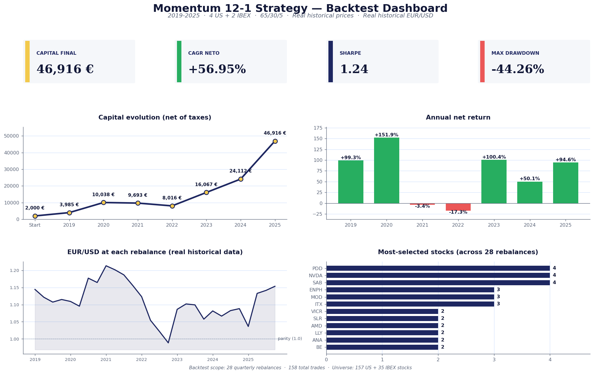

# Backtest results (2019-2025)

Reproducible run of `src/backtest.py` against **REAL historical price data** from `data/monthly-historic-prices.csv` and **REAL historical EUR/USD rates** from `data/eurusd.rates.csv`.

> Re-running `python src/backtest.py` regenerates the JSON/CSV outputs. Then run `python scripts/build_backtest_dashboard.py` and `python scripts/build_backtest_report.py` to regenerate the dashboard image and this markdown report.

## Strategy parameters

- **4 stocks from the US universe** + **2 stocks from IBEX 35** = 6 positions total
- Weights: **65% USA / 30% Spain / 5% cash reserve**
- Rebalancing: **quarterly** (Jan, Apr, Jul, Oct)
- Selection: **dynamic each quarter** (no static pre-selection)
- Fractional shares: enabled
- Initial capital: **2,000 EUR**
- US universe: **157** stocks (NYSE + NASDAQ, includes S&P 500 large caps + non-S&P 500 + recent momentum mid-caps taken from https://stockanalysis.com/stocks/screener/ with 'Change 1Y' column added)
- IBEX universe: **35** stocks (complete IBEX 35)
- Price data: **real historical daily prices** from `data/monthly-historic-prices.csv`, resampled to month-end closes
- EUR/USD: **real historical rates per rebalance day** (from `data/eurusd.rates.csv`)
- Commissions: not modeled (recorded manually in real execution)
- Tax framework: Spanish IRPF "base del ahorro"

## Global summary

| Metric | Value |
|---|---|
| Initial capital | 2.000 € |
| Final capital | **46.916 €** |
| Total return | +2245.78% |
| **CAGR (net of taxes)** | **+56.95%** |
| Annualized volatility | 44.41% |
| **Sharpe ratio** | **1.24** |
| **Max drawdown** | **-44.26%** |
| Total taxes | 10.390 € |
| Total trades | 158 |
| Rebalances | 28 |

## Executive dashboard

## Year-by-year breakdown

| Year | Capital start | Capital end (net) | Net return | Tax paid | Realized gain |
|------|--------------:|------------------:|-----------:|---------:|--------------:|
| 2019 | 2.000 € | 3.985 € | **+99.27%** | 0 € | -38 € |
| 2020 | 3.985 € | 10.038 € | **+151.88%** | 677 € | 3.564 € |
| 2021 | 10.715 € | 9.693 € | **-9.54%** | 858 € | 4.514 € |
| 2022 | 10.550 € | 8.016 € | **-24.02%** | 0 € | -784 € |
| 2023 | 8.016 € | 16.067 € | **+100.44%** | 476 € | 2.503 € |
| 2024 | 16.543 € | 24.112 € | **+45.75%** | 2.454 € | 12.259 € |
| 2025 | 26.566 € | 46.916 € | **+76.60%** | 2.963 € | 14.679 € |

## Most-selected stocks

### US universe (top 15)

| Ticker | Times selected |
|---|---:|
| PDD | 4 |
| NVDA | 4 |
| ENPH | 3 |
| MOD | 3 |
| VICR | 2 |
| AMD | 2 |
| LLY | 2 |
| BE | 2 |
| SITM | 2 |
| MP | 2 |
| CYTK | 2 |
| POWL | 2 |
| ARWR | 1 |
| CIEN | 1 |
| MELI | 1 |

### IBEX 35 (top 10)

| Ticker | Times selected |
|---|---:|
| SAB | 4 |
| ITX | 3 |
| SLR | 2 |
| ANA | 2 |
| FDR | 2 |
| ROVI | 2 |
| REP | 2 |
| IDR | 2 |
| NTGY | 1 |
| MTS | 1 |

## Detailed quarterly trades

One row per executed buy/sell. Sells show realized return at exit; buys leave the return column empty (the return crystallizes when sold).

### 2019 (12 buys, 8 sells, 7.350 € total volume — net annual return **+99.27%**)

| Quarter | Action | Ticker | Market | Shares | Price | EUR/USD | Amount (€) | Return % |
|---------|--------|--------|--------|-------:|------:|--------:|-----------:|---------:|
| Q1 2019 | BUY | ARWR | US | 26.3407 | 14.12 USD | 1.1444 | 325 € |  |
| Q1 2019 | BUY | CIEN | US | 9.7645 | 38.09 USD | 1.1444 | 325 € |  |
| Q1 2019 | BUY | ENPH | US | 51.4426 | 7.23 USD | 1.1444 | 325 € |  |
| Q1 2019 | BUY | NTGY | IBEX | 12.3203 | 24.35 EUR |  | 300 € |  |
| Q1 2019 | BUY | SLR | IBEX | 55.6586 | 5.39 EUR |  | 300 € |  |
| Q1 2019 | BUY | VICR | US | 9.4422 | 39.39 USD | 1.1444 | 325 € |  |
| Q2 2019 | BUY | AMD | US | 14.7296 | 27.63 USD | 1.1215 | 363 € |  |
| Q2 2019 | BUY | ANA | IBEX | 3.2427 | 103.30 EUR |  | 335 € |  |
| Q2 2019 | BUY | LLY | US | 3.4773 | 117.04 USD | 1.1215 | 363 € |  |
| Q2 2019 | SELL | CIEN | US | 9.7645 | 38.36 USD | 1.1215 | 334 € | +2.77% |
| Q2 2019 | SELL | NTGY | IBEX | 12.3203 | 25.32 EUR |  | 312 € | +3.98% |
| Q2 2019 | SELL | VICR | US | 9.4422 | 37.51 USD | 1.1215 | 316 € | -2.83% |
| Q3 2019 | BUY | MELI | US | 0.9725 | 621.42 USD | 1.1074 | 546 € |  |
| Q3 2019 | SELL | ANA | IBEX | 3.2427 | 96.30 EUR |  | 312 € | -6.78% |
| Q3 2019 | SELL | LLY | US | 3.4773 | 108.95 USD | 1.1074 | 342 € | -5.73% |
| Q3 2019 | SELL | SLR | IBEX | 55.6586 | 5.38 EUR |  | 299 € | -0.28% |
| Q4 2019 | BUY | KLAC | US | 3.3812 | 169.04 USD | 1.1150 | 513 € |  |
| Q4 2019 | BUY | PDD | US | 13.9813 | 40.88 USD | 1.1150 | 513 € |  |
| Q4 2019 | SELL | AMD | US | 14.7296 | 33.93 USD | 1.1150 | 448 € | +23.52% |
| Q4 2019 | SELL | MELI | US | 0.9725 | 521.52 USD | 1.1150 | 455 € | -16.65% |

### 2020 (9 buys, 8 sells, 15.859 € total volume — net annual return **+151.88%**)

| Quarter | Action | Ticker | Market | Shares | Price | EUR/USD | Amount (€) | Return % |
|---------|--------|--------|--------|-------:|------:|--------:|-----------:|---------:|
| Q1 2020 | BUY | AMD | US | 14.1626 | 47.00 USD | 1.1093 | 600 € |  |
| Q1 2020 | BUY | TER | US | 10.0870 | 65.99 USD | 1.1093 | 600 € |  |
| Q1 2020 | SELL | KLAC | US | 3.3812 | 165.74 USD | 1.1093 | 505 € | -1.45% |
| Q1 2020 | SELL | PDD | US | 13.9813 | 35.22 USD | 1.1093 | 444 € | -13.40% |
| Q2 2020 | BUY | PDD | US | 16.1947 | 47.44 USD | 1.0955 | 701 € |  |
| Q2 2020 | BUY | TSLA | US | 14.7377 | 52.13 USD | 1.0955 | 701 € |  |
| Q2 2020 | SELL | ARWR | US | 26.3407 | 34.43 USD | 1.0955 | 828 € | +154.72% |
| Q2 2020 | SELL | TER | US | 10.0870 | 62.54 USD | 1.0955 | 576 € | -4.03% |
| Q3 2020 | BUY | NVDA | US | 109.3136 | 10.61 USD | 1.1774 | 985 € |  |
| Q3 2020 | BUY | SLR | IBEX | 70.8723 | 12.83 EUR |  | 909 € |  |
| Q3 2020 | BUY | VICR | US | 14.2361 | 81.47 USD | 1.1774 | 985 € |  |
| Q3 2020 | SELL | AMD | US | 14.1626 | 77.43 USD | 1.1774 | 931 € | +55.22% |
| Q3 2020 | SELL | ENPH | US | 51.4426 | 60.36 USD | 1.1774 | 2.637 € | +711.46% |
| Q4 2020 | BUY | BE | US | 103.7180 | 12.64 USD | 1.1647 | 1.126 € |  |
| Q4 2020 | BUY | ENPH | US | 13.3652 | 98.09 USD | 1.1647 | 1.126 € |  |
| Q4 2020 | SELL | PDD | US | 16.1947 | 89.98 USD | 1.1647 | 1.251 € | +78.40% |
| Q4 2020 | SELL | VICR | US | 14.2361 | 78.00 USD | 1.1647 | 953 € | -3.22% |

### 2021 (10 buys, 10 sells, 35.339 € total volume — net annual return **-9.54%**)

| Quarter | Action | Ticker | Market | Shares | Price | EUR/USD | Amount (€) | Return % |
|---------|--------|--------|--------|-------:|------:|--------:|-----------:|---------:|
| Q1 2021 | BUY | PDD | US | 13.7557 | 165.71 USD | 1.2136 | 1.878 € |  |
| Q1 2021 | BUY | SITM | US | 18.6764 | 122.05 USD | 1.2136 | 1.878 € |  |
| Q1 2021 | SELL | BE | US | 103.7180 | 34.91 USD | 1.2136 | 2.984 € | +165.06% |
| Q1 2021 | SELL | NVDA | US | 109.3136 | 12.99 USD | 1.2136 | 1.170 € | +18.78% |
| Q2 2021 | BUY | GSAT | US | 99.4898 | 19.05 USD | 1.2018 | 1.577 € |  |
| Q2 2021 | BUY | HUT | US | 69.5516 | 27.25 USD | 1.2018 | 1.577 € |  |
| Q2 2021 | BUY | MTS | IBEX | 60.0918 | 24.23 EUR |  | 1.456 € |  |
| Q2 2021 | SELL | ENPH | US | 13.3652 | 139.25 USD | 1.2018 | 1.549 € | +37.58% |
| Q2 2021 | SELL | PDD | US | 13.7557 | 133.93 USD | 1.2018 | 1.533 € | -18.38% |
| Q2 2021 | SELL | SLR | IBEX | 70.8723 | 17.05 EUR |  | 1.209 € | +32.93% |
| Q3 2021 | BUY | FDR | IBEX | 46.6492 | 34.15 EUR |  | 1.593 € |  |
| Q3 2021 | BUY | MOD | US | 122.4480 | 16.73 USD | 1.1870 | 1.726 € |  |
| Q3 2021 | BUY | MP | US | 54.4539 | 37.62 USD | 1.1870 | 1.726 € |  |
| Q3 2021 | SELL | SITM | US | 18.6764 | 135.64 USD | 1.1870 | 2.134 € | +13.63% |
| Q3 2021 | SELL | TSLA | US | 14.7377 | 229.07 USD | 1.1870 | 2.844 € | +305.55% |
| Q4 2021 | BUY | SAB | IBEX | 2781.8787 | 0.70 EUR |  | 1.937 € |  |
| Q4 2021 | BUY | SITM | US | 9.1599 | 264.89 USD | 1.1561 | 2.099 € |  |
| Q4 2021 | SELL | FDR | IBEX | 46.6492 | 33.05 EUR |  | 1.542 € | -3.22% |
| Q4 2021 | SELL | MOD | US | 122.4480 | 11.00 USD | 1.1561 | 1.165 € | -32.49% |
| Q4 2021 | SELL | MTS | IBEX | 60.0918 | 29.34 EUR |  | 1.763 € | +21.11% |

### 2022 (16 buys, 15 sells, 46.517 € total volume — net annual return **-24.02%**)

| Quarter | Action | Ticker | Market | Shares | Price | EUR/USD | Amount (€) | Return % |
|---------|--------|--------|--------|-------:|------:|--------:|-----------:|---------:|
| Q1 2022 | BUY | CYTK | US | 55.7336 | 33.19 USD | 1.1233 | 1.647 € |  |
| Q1 2022 | BUY | FDR | IBEX | 54.0954 | 28.10 EUR |  | 1.520 € |  |
| Q1 2022 | BUY | NVDA | US | 75.5328 | 24.49 USD | 1.1233 | 1.647 € |  |
| Q1 2022 | BUY | ROVI | IBEX | 23.2428 | 65.40 EUR |  | 1.520 € |  |
| Q1 2022 | SELL | GSAT | US | 99.4898 | 16.05 USD | 1.1233 | 1.422 € | -9.86% |
| Q1 2022 | SELL | MP | US | 54.4539 | 39.94 USD | 1.1233 | 1.936 € | +12.19% |
| Q1 2022 | SELL | SAB | IBEX | 2781.8787 | 0.69 EUR |  | 1.912 € | -1.29% |
| Q2 2022 | BUY | COP | US | 16.2568 | 95.52 USD | 1.0541 | 1.473 € |  |
| Q2 2022 | BUY | MP | US | 40.8214 | 38.04 USD | 1.0541 | 1.473 € |  |
| Q2 2022 | BUY | SAB | IBEX | 1827.7297 | 0.74 EUR |  | 1.360 € |  |
| Q2 2022 | SELL | CYTK | US | 55.7336 | 39.87 USD | 1.0541 | 2.108 € | +28.01% |
| Q2 2022 | SELL | FDR | IBEX | 54.0954 | 26.12 EUR |  | 1.413 € | -7.05% |
| Q2 2022 | SELL | HUT | US | 69.5516 | 17.80 USD | 1.0541 | 1.174 € | -25.53% |
| Q3 2022 | BUY | ANA | IBEX | 6.4889 | 200.60 EUR |  | 1.302 € |  |
| Q3 2022 | BUY | CVX | US | 8.7976 | 163.78 USD | 1.0218 | 1.410 € |  |
| Q3 2022 | BUY | EOG | US | 13.5663 | 106.21 USD | 1.0218 | 1.410 € |  |
| Q3 2022 | BUY | REP | IBEX | 107.3538 | 12.12 EUR |  | 1.302 € |  |
| Q3 2022 | BUY | XOM | US | 14.8651 | 96.93 USD | 1.0218 | 1.410 € |  |
| Q3 2022 | SELL | MP | US | 40.8214 | 33.57 USD | 1.0218 | 1.341 € | -8.96% |
| Q3 2022 | SELL | NVDA | US | 75.5328 | 18.16 USD | 1.0218 | 1.342 € | -18.48% |
| Q3 2022 | SELL | ROVI | IBEX | 23.2428 | 51.00 EUR |  | 1.185 € | -22.02% |
| Q3 2022 | SELL | SAB | IBEX | 1827.7297 | 0.62 EUR |  | 1.142 € | -16.05% |
| Q3 2022 | SELL | SITM | US | 9.1599 | 185.98 USD | 1.0218 | 1.667 € | -20.56% |
| Q4 2022 | BUY | ANE | IBEX | 38.1567 | 39.76 EUR |  | 1.517 € |  |
| Q4 2022 | BUY | CABK | IBEX | 452.4633 | 3.35 EUR |  | 1.517 € |  |
| Q4 2022 | BUY | CYTK | US | 37.2035 | 43.66 USD | 0.9883 | 1.644 € |  |
| Q4 2022 | BUY | ON | US | 26.4416 | 61.43 USD | 0.9883 | 1.644 € |  |
| Q4 2022 | SELL | ANA | IBEX | 6.4889 | 182.10 EUR |  | 1.182 € | -9.22% |
| Q4 2022 | SELL | CVX | US | 8.7976 | 180.90 USD | 0.9883 | 1.610 € | +14.20% |
| Q4 2022 | SELL | EOG | US | 13.5663 | 131.99 USD | 0.9883 | 1.812 € | +28.49% |
| Q4 2022 | SELL | REP | IBEX | 107.3538 | 13.74 EUR |  | 1.476 € | +13.36% |

### 2023 (16 buys, 16 sells, 54.025 € total volume — net annual return **+100.44%**)

| Quarter | Action | Ticker | Market | Shares | Price | EUR/USD | Amount (€) | Return % |
|---------|--------|--------|--------|-------:|------:|--------:|-----------:|---------:|
| Q1 2023 | BUY | ENPH | US | 7.9558 | 221.38 USD | 1.0862 | 1.621 € |  |
| Q1 2023 | BUY | LLY | US | 5.1177 | 344.15 USD | 1.0862 | 1.621 € |  |
| Q1 2023 | BUY | MOD | US | 73.7240 | 23.89 USD | 1.0862 | 1.621 € |  |
| Q1 2023 | BUY | REP | IBEX | 99.1890 | 15.09 EUR |  | 1.497 € |  |
| Q1 2023 | BUY | SANM | US | 28.9064 | 60.93 USD | 1.0862 | 1.621 € |  |
| Q1 2023 | SELL | CABK | IBEX | 452.4633 | 4.07 EUR |  | 1.840 € | +21.29% |
| Q1 2023 | SELL | COP | US | 16.2568 | 121.87 USD | 1.0862 | 1.824 € | +23.82% |
| Q1 2023 | SELL | CYTK | US | 37.2035 | 42.48 USD | 1.0862 | 1.455 € | -11.47% |
| Q1 2023 | SELL | ON | US | 26.4416 | 73.45 USD | 1.0862 | 1.788 € | +8.79% |
| Q1 2023 | SELL | XOM | US | 14.8651 | 116.01 USD | 1.0862 | 1.588 € | +12.59% |
| Q2 2023 | BUY | ITX | IBEX | 42.9572 | 31.16 EUR |  | 1.339 € |  |
| Q2 2023 | BUY | NFLX | US | 48.4389 | 32.99 USD | 1.1020 | 1.450 € |  |
| Q2 2023 | BUY | PDD | US | 23.4483 | 68.15 USD | 1.1020 | 1.450 € |  |
| Q2 2023 | BUY | POWL | US | 119.7003 | 13.35 USD | 1.1020 | 1.450 € |  |
| Q2 2023 | BUY | SAB | IBEX | 1416.7496 | 0.94 EUR |  | 1.339 € |  |
| Q2 2023 | SELL | ANE | IBEX | 38.1567 | 32.56 EUR |  | 1.242 € | -18.11% |
| Q2 2023 | SELL | ENPH | US | 7.9558 | 164.20 USD | 1.1020 | 1.185 € | -26.89% |
| Q2 2023 | SELL | LLY | US | 5.1177 | 395.86 USD | 1.1020 | 1.838 € | +13.38% |
| Q2 2023 | SELL | REP | IBEX | 99.1890 | 13.35 EUR |  | 1.324 € | -11.56% |
| Q2 2023 | SELL | SANM | US | 28.9064 | 52.26 USD | 1.1020 | 1.371 € | -15.46% |
| Q3 2023 | BUY | AAOI | US | 321.6336 | 6.75 USD | 1.0993 | 1.975 € |  |
| Q3 2023 | BUY | BBVA | IBEX | 252.8434 | 7.21 EUR |  | 1.823 € |  |
| Q3 2023 | BUY | NVDA | US | 46.4590 | 46.73 USD | 1.0993 | 1.975 € |  |
| Q3 2023 | SELL | ITX | IBEX | 42.9572 | 34.81 EUR |  | 1.495 € | +11.71% |
| Q3 2023 | SELL | NFLX | US | 48.4389 | 43.90 USD | 1.0993 | 1.934 € | +33.40% |
| Q3 2023 | SELL | PDD | US | 23.4483 | 89.82 USD | 1.0993 | 1.916 € | +32.12% |
| Q4 2023 | BUY | IDR | IBEX | 150.5891 | 13.25 EUR |  | 1.995 € |  |
| Q4 2023 | BUY | ITX | IBEX | 61.2997 | 32.55 EUR |  | 1.995 € |  |
| Q4 2023 | BUY | META | US | 7.5882 | 301.27 USD | 1.0576 | 2.162 € |  |
| Q4 2023 | SELL | BBVA | IBEX | 252.8434 | 7.42 EUR |  | 1.877 € | +2.94% |
| Q4 2023 | SELL | MOD | US | 73.7240 | 39.50 USD | 1.0576 | 2.754 € | +69.81% |
| Q4 2023 | SELL | SAB | IBEX | 1416.7496 | 1.17 EUR |  | 1.659 € | +23.94% |

### 2024 (11 buys, 11 sells, 81.349 € total volume — net annual return **+45.75%**)

| Quarter | Action | Ticker | Market | Shares | Price | EUR/USD | Amount (€) | Return % |
|---------|--------|--------|--------|-------:|------:|--------:|-----------:|---------:|
| Q1 2024 | BUY | ACS | IBEX | 80.1519 | 36.59 EUR |  | 2.933 € |  |
| Q1 2024 | BUY | MOD | US | 49.7381 | 69.09 USD | 1.0816 | 3.177 € |  |
| Q1 2024 | BUY | ROVI | IBEX | 45.7885 | 64.05 EUR |  | 2.933 € |  |
| Q1 2024 | BUY | VRT | US | 61.0049 | 56.33 USD | 1.0816 | 3.177 € |  |
| Q1 2024 | SELL | IDR | IBEX | 150.5891 | 16.47 EUR |  | 2.480 € | +24.30% |
| Q1 2024 | SELL | ITX | IBEX | 61.2997 | 39.71 EUR |  | 2.434 € | +22.00% |
| Q1 2024 | SELL | META | US | 7.5882 | 390.14 USD | 1.0816 | 2.737 € | +26.62% |
| Q1 2024 | SELL | POWL | US | 119.7003 | 39.51 USD | 1.0816 | 4.373 € | +201.54% |
| Q2 2024 | BUY | POWL | US | 84.5532 | 47.67 USD | 1.0665 | 3.779 € |  |
| Q2 2024 | SELL | ACS | IBEX | 80.1519 | 37.58 EUR |  | 3.012 € | +2.71% |
| Q2 2024 | SELL | NVDA | US | 46.4590 | 86.40 USD | 1.0665 | 3.764 € | +90.58% |
| Q3 2024 | BUY | ASTS | US | 208.7653 | 20.68 USD | 1.0825 | 3.988 € |  |
| Q3 2024 | BUY | NVDA | US | 36.8934 | 117.02 USD | 1.0825 | 3.988 € |  |
| Q3 2024 | SELL | AAOI | US | 321.6336 | 9.55 USD | 1.0825 | 2.838 € | +43.68% |
| Q3 2024 | SELL | POWL | US | 84.5532 | 61.21 USD | 1.0825 | 4.781 € | +26.51% |
| Q4 2024 | BUY | IESC | US | 21.6776 | 218.66 USD | 1.0883 | 4.355 € |  |
| Q4 2024 | BUY | ITX | IBEX | 76.8720 | 52.30 EUR |  | 4.020 € |  |
| Q4 2024 | BUY | SAB | IBEX | 2247.9202 | 1.79 EUR |  | 4.020 € |  |
| Q4 2024 | BUY | SMTC | US | 107.2646 | 44.19 USD | 1.0883 | 4.355 € |  |
| Q4 2024 | SELL | NVDA | US | 36.8934 | 132.76 USD | 1.0883 | 4.501 € | +12.85% |
| Q4 2024 | SELL | ROVI | IBEX | 45.7885 | 78.10 EUR |  | 3.576 € | +21.94% |
| Q4 2024 | SELL | VRT | US | 61.0049 | 109.29 USD | 1.0883 | 6.126 € | +92.82% |

### 2025 (8 buys, 8 sells, 100.371 € total volume — net annual return **+76.60%**)

| Quarter | Action | Ticker | Market | Shares | Price | EUR/USD | Amount (€) | Return % |
|---------|--------|--------|--------|-------:|------:|--------:|-----------:|---------:|
| Q1 2025 | BUY | HOOD | US | 96.5335 | 51.95 USD | 1.0362 | 4.840 € |  |
| Q1 2025 | BUY | IAG | IBEX | 1106.3476 | 4.04 EUR |  | 4.467 € |  |
| Q1 2025 | BUY | PLTR | US | 60.7942 | 82.49 USD | 1.0362 | 4.840 € |  |
| Q1 2025 | BUY | RKLB | US | 172.6305 | 29.05 USD | 1.0362 | 4.840 € |  |
| Q1 2025 | SELL | IESC | US | 21.6776 | 221.28 USD | 1.0362 | 4.629 € | +6.29% |
| Q1 2025 | SELL | ITX | IBEX | 76.8720 | 52.72 EUR |  | 4.053 € | +0.80% |
| Q1 2025 | SELL | MOD | US | 49.7381 | 101.45 USD | 1.0362 | 4.870 € | +53.27% |
| Q1 2025 | SELL | SMTC | US | 107.2646 | 66.96 USD | 1.0362 | 6.932 € | +59.15% |
| Q2 2025 | BUY | IDR | IBEX | 154.6641 | 28.02 EUR |  | 4.334 € |  |
| Q2 2025 | SELL | SAB | IBEX | 2247.9202 | 2.56 EUR |  | 5.764 € | +43.36% |
| Q3 2025 | BUY | AGX | US | 35.8437 | 244.98 USD | 1.1416 | 7.692 € |  |
| Q3 2025 | SELL | ASTS | US | 208.7653 | 53.17 USD | 1.1416 | 9.723 € | +143.80% |
| Q4 2025 | BUY | BE | US | 84.4445 | 132.16 USD | 1.1536 | 9.674 € |  |
| Q4 2025 | BUY | UNI | IBEX | 3816.2608 | 2.34 EUR |  | 8.930 € |  |
| Q4 2025 | SELL | AGX | US | 35.8437 | 306.21 USD | 1.1536 | 9.514 € | +23.69% |
| Q4 2025 | SELL | IAG | IBEX | 1106.3476 | 4.76 EUR |  | 5.271 € | +17.98% |

## Important notes

- **Real prices**: daily closes from `data/monthly-historic-prices.csv`, resampled to month-end. Covers all IBEX 35 plus the full US large/mid-cap universe defined in `src/universe.py`.
- **Real EUR/USD historical rates** are used per rebalance day. The rate moved from ~1.15 in 2019 to parity (~1.00) in 2022 and back to ~1.15 in 2025.
- **No commissions are modeled** in the backtest. Real execution will subtract 0.1-0.3% per year of CAGR depending on broker tier.
- **Survivorship bias**: the universe contains stocks that exist today. Stocks that delisted are not represented.
- **Composition timing bias**: some stocks IPO'd within the backtest window (PLTR 2020, NU 2021, ARM 2023, SNDK relisted 2025). They enter the universe as their data becomes available.

A real-money implementation should expect **5-15 percentage points lower CAGR** than this backtest, due to commissions, execution timing, slippage, and the fact that the future regime will not be 2019-2025.
